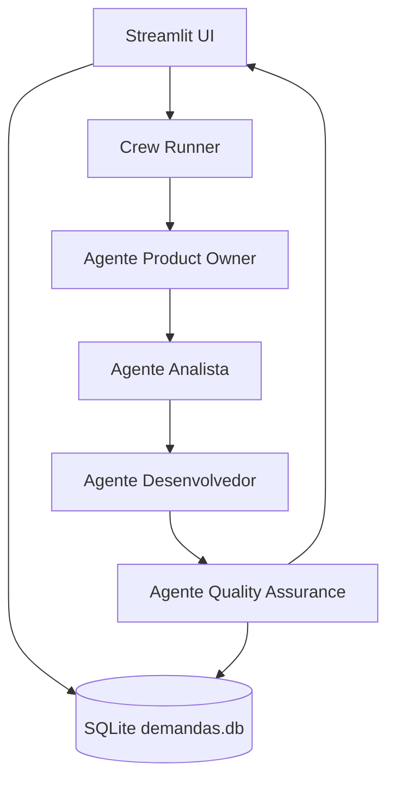

# Squad-AI Brownfield Architecture

Esta documentação descreve a arquitetura atual do projeto **Squad-AI**, mapeada sistematicamente pelo Synkra AIOS.

## 1. Introduction
Este documento serve como a base arquitetural para o projeto **Squad-AI**, um sistema multi-agente projetado para automatizar fluxos de desenvolvimento ágil.

## 2. Existing Project Analysis

### Current Project State
- **Primary Purpose:** Automação de Squad Ágil (User Story -> Spec -> Code -> QA).
- **Current Tech Stack:**
    - **Language:** Python 3.10+
    - **Orquestração de Agentes:** CrewAI
    - **Interface Web:** Streamlit
    - **Banco de Dados:** SQLite
    - **LLM:** Gemini (via Google AI SDK)
    - **Integração:** Jira API (opcional)
- **Architecture Style:** Sistema Multi-Agente (MAS) com workflow sequencial.
- **Deployment Method:** Local/Python Environment (provável integração futura com Railway).

### Identified Constraints
- Fluxo estritamente sequencial.
- Dependência de chaves de API externas (Gemini, Jira).
- Persistência baseada em arquivo local (`demandas.db`).

## 3. Component Architecture

### Squad Design (CrewAI)
O sistema orquestra 4 agentes especializados:

1.  **👔 Product Owner**: Responsável por transformar demandas em User Stories. Integra com Jira.
2.  **📋 Analista de Sistemas**: Gera especificações técnicas detalhadas a partir das User Stories.
3.  **💻 Desenvolvedor Python**: Implementa o código baseado na especificação técnico.
4.  **✅ Quality Assurance (QA)**: Executa testes simulados e valida a qualidade final.

### Interaction Diagram

## 4. Data Models
O sistema utiliza um banco de dados SQLite (`demandas.db`) com a seguinte estrutura:

### Table: `demandas`
- `id`: INTEGER (PK)
- `titulo`: TEXT
- `descricao`: TEXT
- `usar_jira`: BOOLEAN
- `status`: TEXT (pendente, executando, concluida, erro)
- `created_at`: TIMESTAMP

### Table: `resultados`
- `id`: INTEGER (PK)
- `demanda_id`: INTEGER (FK)
- `agente`: TEXT
- `resultado`: TEXT (Markdown/Output do Agente)

## 5. Coding Standards
- **Linguagem:** Python idiomático.
- **Estrutura:** Baseado no template padrão do CrewAI (config YAML + logic Python).
- **Interface:** Streamlit para visualização rápida e interativa.

---
— Orion, orquestrando o sistema 🎯
